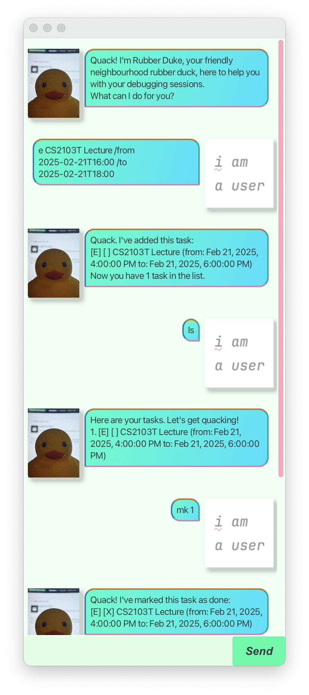

# Rubber Duke



Rubber Duke is a rubber duck for debugging that also helps you manage your tasks with a fast command-line interface and beautiful graphical user interface.

> **If ducks are so smart, why don’t we just let the ducks do all the work?** It would be wonderful if this were true, but the fact is that most ducks prefer to take a mentoring role. - https://rubberduckdebugging.com/

## Quick start

1. Install Java 17 by following the instructions at https://nus-cs2103-ay2425s2.github.io/website/admin/programmingLanguages.html
1. Download the latest [release](https://github.com/keyansheng/ip/releases)
1. Run with the following command, where `rubberduke.jar` is the path to the release you downloaded
   ```sh
   java -jar rubberduke.jar
   ```
1. Refer to the [user guide](https://keyansheng.github.io/ip/)
