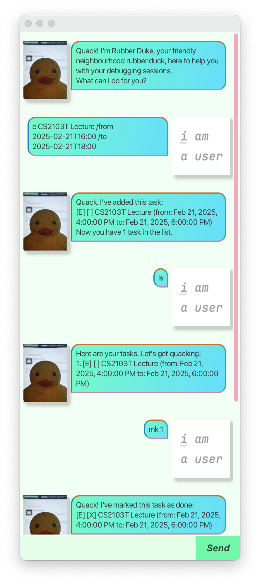

# Rubber Duke User Guide



Rubber Duke is a rubber duck for debugging that also helps you manage your tasks with a fast command-line interface and beautiful graphical user interface.

> **If ducks are so smart, why don’t we just let the ducks do all the work?** It would be wonderful if this were true, but the fact is that most ducks prefer to take a mentoring role. - https://rubberduckdebugging.com/

## Quick start

1. Install Java 17 by following the instructions at https://nus-cs2103-ay2425s2.github.io/website/admin/programmingLanguages.html
1. Download the latest [release](https://github.com/keyansheng/ip/releases)
1. Run with the following command, where `rubberduke.jar` is the path to the release you downloaded
   ```sh
   java -jar rubberduke.jar
   ```

## Add tasks

There are three types of tasks available: todos, deadlines with an end time, and events with start and end times. Tasks can be added by entering the full task type or a quick one-letter abbreviation, followed by the description and start/end times if applicable.

```
todo Write user guide
deadline Submit user guide /by 2025-02-21T23:59
event Attend CS2103T Lecture /from 2025-02-21T16:00 /to 2025-02-21T18:00
t Write user guide
d Submit user guide /by 2025-02-21T23:59
e Attend CS2103T Lecture /from 2025-02-21T16:00 /to 2025-02-21T18:00
```

Other commands have two-letter abbreviations, inspired by Unix commands for familiarity.

## List tasks

Tasks can be displayed with the list command. Recognised start and end times are displayed based on your system locale.

```
list
ls
```

## Delete tasks

Tasks can be deleted by specifying the task number.

```
delete 1
remove 1
rm 1
```

## Mark and unmark tasks

Tasks can be marked and unmarked as done by specifying the task number.

```
mark 1
unmark 1
mk 1
um 1
```

## Find tasks

Tasks can be searched by description.

```
find user guide
fd user guide
```
